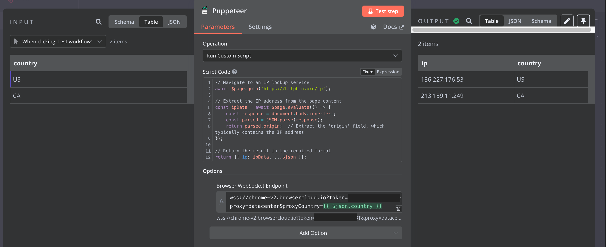
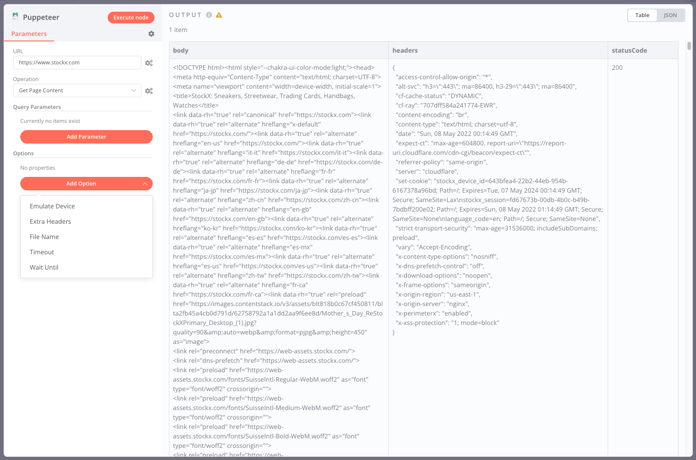
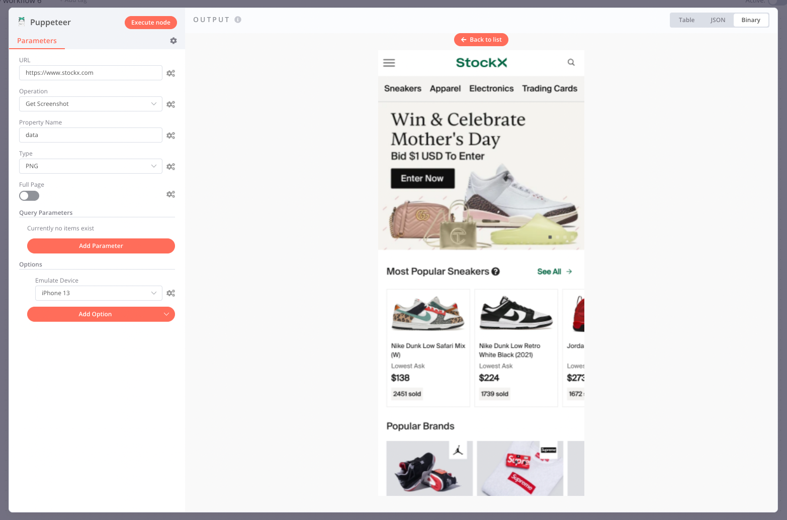

# n8n-automation


> **Project by [Shahid Afrid](https://github.com/akhi-shxhid)  
> Licensed by Shahid Afrid and GitHub  
> Designed to showcase skills in automation**

---

Welcome to **n8n-automation** — a TypeScript-powered project designed to demonstrate advanced automation skills using [n8n](https://www.n8n.io), Puppeteer, and custom scripting. This repository is crafted by Shahid Afrid to illustrate powerful workflow automation, browser control, and integration techniques.

---

## 🚀 Project Overview

This project extends n8n with custom nodes for browser automation using [Puppeteer](https://pptr.dev/). You can execute scripts, capture screenshots and PDFs, scrape content, and automate web interactions leveraging Chrome/Chromium's DevTools Protocol. Full access to Puppeteer's API plus n8n's Code node capabilities makes this solution ideal for any complex browser automation task.

### Key Features

- **Custom n8n Node for Puppeteer**
- **Browser Automation**
- **Screenshot & PDF Capture**
- **Content Scraping**
- **Remote/Local Browser Support**
- **Built-in Docker Support**
- **Advanced Scripting with n8n Code Node**

---

## 🛠️ Installation

### 1. Community Nodes (Recommended)

For n8n version `0.187` and later, install via the Community Nodes panel:

1. Go to **Settings > Community Nodes**
2. Select **Install**
3. Enter: `n8n-nodes-puppeteer`
4. Agree to the [risks](https://docs.n8n.io/integrations/community-nodes/risks/)
5. Click **Install**

### 2. Docker (Recommended for Production)

Ready-to-use Docker setup (see `docker/` directory):

```bash
git clone https://github.com/akhi-shxhid/n8n-automation
cd n8n-automation/docker
docker build -t n8n-puppeteer -f Dockerfile .
docker run -it -p 5678:5678 -v ~/.n8n:/home/node/.n8n n8n-puppeteer
```

### 3. Manual Installation

```bash
cd /path/to/n8n
npm install n8n-nodes-puppeteer
```

> *Tip: For production, use Docker or install system Chrome/Chromium and set `PUPPETEER_SKIP_CHROMIUM_DOWNLOAD=true`.*

---

## 🌐 Browser Setup Options

- **Local Browser**: Use Docker setup for reliability.
- **Remote Browser**: Connect to an external Chrome instance (e.g., [browserless](https://browserless.io), [browsercloud](https://browsercloud.io)).  
  Example:
  ```bash
  docker run -p 3000:3000 -e "TOKEN=6R0W53R135510" ghcr.io/browserless/chromium
  ```
  Configure the node with your WebSocket URL (e.g., `ws://browserless:3000?token=XXXXXX`).

---

## 🧑‍💻 Node Reference

**Operations:**
- Get HTML content
- Capture PDF
- Take screenshots
- Run custom scripts

**Options:**
- Batch size
- Browser WebSocket Endpoint
- Emulate device
- Executable path
- Extra headers
- Timeout
- Wait until (e.g., `load`, `domcontentloaded`)
- Page caching
- Headless mode
- Chrome Headless Shell
- Stealth mode ([puppeteer-extra-plugin-stealth](https://github.com/berstend/puppeteer-extra/tree/master/packages/puppeteer-extra-plugin-stealth))
- Launch arguments
- Proxy server

**PDF Options:**  
File name, page ranges, scale, CSS page size, format, height/width, landscape, margin, header/footer templates, transparency, background graphics.

**Screenshot Options:**  
File name, type (`jpeg`, `png`, `webp`), quality, full page.

---

## 📝 Custom Scripts

Take full control of Puppeteer for advanced browser automation. Scripts run in a secure sandbox with full access to Puppeteer's API and n8n's special variables.

```javascript
// Example: Get IP address
await $page.goto("https://httpbin.org/ip");
const ipData = await $page.evaluate(() => JSON.parse(document.body.innerText).origin);
console.log("IP Address:", ipData);
return [{ ip: ipData, ...$json }];
```

**Re-use Cookies:**
```javascript
// Node 1: Store cookies
await $page.goto("https://www.example.com/login");
await $page.type("#login-username", "user");
await $page.type("#login-password", "pass");
await $page.click("#login-button");
const cookies = await $page.cookies();
return [{ cookies }];
```
```javascript
// Node 2: Restore cookies
const { cookies } = $input.first().json;
await $page.setCookie(...cookies);
await $page.goto("https://example.com/protected-page");
const data = await $page.evaluate(() => document.querySelector(".protected-content").textContent);
return [{ data }];
```

**Binary Data:**
```javascript
await $page.goto("https://www.google.com");
const imageData = await $page.screenshot({ type: "png", encoding: "base64" });
return [{ binary: { screenshot: { data: imageData, mimeType: "image/png", fileName: "screenshot.png" } } }];
```

---

## 🖼️ Screenshots

| Custom Script | Page Content | Screenshot |
|---|---|---|
|  |  |  |

---

## 🆘 Troubleshooting

Missing shared library errors (e.g., `libgobject-2.0.so.0`, `libnss3.so`)?  
- Install missing Chrome dependencies  
- OR use a remote browser with WebSocket endpoint

See [Puppeteer's troubleshooting guide](https://pptr.dev/troubleshooting) for more help.

---

## 📄 License

**Licensed by Shahid Afrid and GitHub.**  
See [LICENSE](./LICENSE) for details.

---

## 🙌 Credits

Made by [Shahid Afrid](https://github.com/akhi-shxhid).  
Showcasing automation skills, browser scripting, and n8n integration.

--
